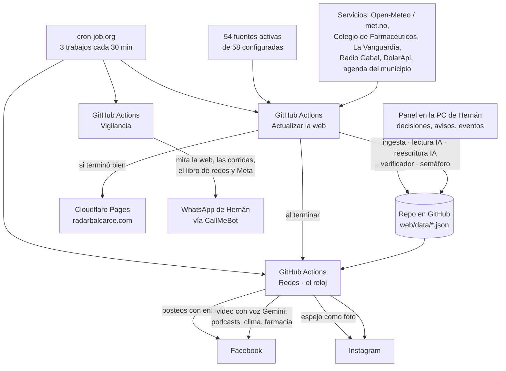

# Radar Balcarce 3.0

**El proyecto entero, de punta a punta.** Escrito el 27/09/2026 leyendo el
repositorio (código y documentos) tal como estaba ese día, commit `c5b6696`.
Es para Hernán y Andrés, que no son programadores, y para cualquiera que tenga
que mantenerlo. Cuando algo no se pudo confirmar en el código, se dice.

Este documento **no reemplaza** a los otros: los resume y los ordena. Si algo
de acá choca con `CRITERIO-EDITORIAL.md` (el criterio) o con el código, mandan
esos dos. Al final de la respuesta que acompaña este archivo hay una lista de
inconsistencias encontradas entre documentos y código.

---

## Índice

1. [Qué es Radar Balcarce](#1-qué-es-radar-balcarce)
2. [El mapa general](#2-el-mapa-general)
3. [Las fuentes](#3-las-fuentes)
4. [El recorrido de una nota, paso a paso](#4-el-recorrido-de-una-nota-paso-a-paso)
5. [El criterio editorial y las instrucciones de la IA](#5-el-criterio-editorial-y-las-instrucciones-de-la-ia)
6. [Notas propias](#6-notas-propias)
7. [Redes](#7-redes)
8. [El sitio web](#8-el-sitio-web)
9. [El panel](#9-el-panel)
10. [La vigilancia y los avisos por WhatsApp](#10-la-vigilancia-y-los-avisos-por-whatsapp)
11. [Infraestructura y cuentas](#11-infraestructura-y-cuentas)
12. [Archivos importantes y dónde tocar cada cosa](#12-archivos-importantes-y-dónde-tocar-cada-cosa)
13. [Reglas que no se negocian y cómo se controlan](#13-reglas-que-no-se-negocian-y-cómo-se-controlan)
14. [Hoja de ruta](#14-hoja-de-ruta)
15. [Glosario](#15-glosario)

---

## 1. Qué es Radar Balcarce

Radar Balcarce es un **medio digital automático** de Balcarce, provincia de
Buenos Aires, en `radarbalcarce.com`, con Instagram `@radarbalcarce` y la
página de Facebook "Radar Balcarce". Cada media hora lee los medios de la
zona, los organismos públicos y algunos diarios nacionales; junta la misma
noticia contada por varios; decide qué se publica solo y qué espera a una
persona; lo reescribe con IA (Gemini); verifica lo escrito contra la fuente;
arma el sitio y lo sube. Varias veces por día publica en Facebook e Instagram
con una voz de IA. **Todo eso corre en GitHub con la PC apagada.** Lo único que
vive en la PC de Hernán es el panel, donde las personas deciden lo que el
sistema no puede decidir solo. El proyecto arrancó el 18/09/2026 (primer
commit) y al 27/09 lleva 669 commits.

**El principio que decide todo** (plan V2.2, § 2):

> **¿Qué valor tiene esta nota para alguien que vive en Balcarce?**

Una nota entra por una razón que se pueda decir: pasó en Balcarce (local),
cambia algo práctico para los vecinos (servicio), es una actividad de la
ciudad (automovilismo, papa, campo, INTA), es una medida provincial con efecto
acá, o es una noticia nacional importante. Si no hay razón, no entra. Lo local
pesa más que cualquier cosa de afuera; se informa sin gritar; cada nota dice
de dónde sale y quién la escribió.

---

## 2. El mapa general

En palabras: **cron-job.org** (un servicio gratuito externo) toca tres
timbres cada 30 minutos en GitHub. "Actualizar la web" lee las fuentes, decide,
escribe y guarda los datos en el repositorio; si todo salió bien, "Cloudflare
Pages" compila el sitio y lo publica. "Redes" mira qué toca a esa hora y
publica en Meta. "Vigilancia" revisa que todo ande y avisa por WhatsApp. El
panel de la PC sólo aporta las decisiones humanas, que sube solo al
repositorio; si la PC está apagada, todo lo demás sigue.

---

## 3. Las fuentes

Están todas en `ingesta/fuentes.mjs`. Son **58 configuradas; 54 activas y 4
apagadas** (`activa: false`). Cinco son **señal** (`uso: 'senal'`): sus notas
no salen solas, sólo cuentan cuántos medios cuentan una misma historia.

Cómo leer la tabla:

- **Tipo**: la ficha que arma `fichaDeFuente` (oficial, medio de Balcarce, de
  la región, provincial, nacional por sección, nacional general).
- **Lectura**: RSS, Atom o raspado (se lee la portada del sitio porque no
  tiene feed, y se entra a cada nota para sacar bajada y hora).
- **Peso**: el puntaje de arranque.
- **Máx.**: cuántas notas "de relleno" entran por corrida, además de las que
  dicen Balcarce en el título, nombran a una figura argentina o tocan la zona.
  0 = sólo esas. En las de Balcarce no aplica: entra todo.
- **Uso**: candidata (puede publicarse) o señal.

### 3.1 Medios de Balcarce (11) — entra todo

| # | Fuente | Tipo | Lectura | Sección fija | Peso | Para qué |
|---|---|---|---|---|---|---|
| 1 | News Balcarce (FM 91.7) | medio de Balcarce | RSS | — | 30 | Texto completo e imagen |
| 2 | Puntonueve (FM 100.9) | medio de Balcarce | RSS | — | 30 | Sólo resumen; el más rápido en avisar |
| 3 | Infórmese Primero (FM 104.9) | medio de Balcarce | Atom (Blogger) | — | 30 | Texto completo |
| 4 | Radio Gabal · Comunidad | medio de Balcarce | RSS | Balcarce | 28 | Comunidad |
| 5 | Radio Gabal · Policiales | medio de Balcarce | RSS | Policiales | 28 | La vía principal de policiales locales |
| 6 | Radio Gabal · Política | medio de Balcarce | RSS | Política | 28 | Política local |
| 7 | Radio Gabal · Deportes | medio de Balcarce | RSS | Deportes | 26 | Deporte local |
| 8 | Radio Gabal · Agro | medio de Balcarce | RSS | Agro | 26 | Campo local |
| 9 | Municipalidad de Balcarce | **oficial** | RSS | — | 24 | Fuente primaria de sus anuncios; da verificación ALTA |
| 10 | El Diario Balcarce | medio de Balcarce | Raspado | — | 28 | Su sección Rural no la cubre nadie más |
| 11 | La Vanguardia | medio de Balcarce | Raspado | — | 28 | Campo y Salud; también la farmacia de turno |

### 3.2 Región (9)

| # | Fuente | Ciudad | Lectura | Sección fija | Peso | Máx. | Para qué |
|---|---|---|---|---|---|---|---|
| 12 | 0223 | Mar del Plata | RSS | — | 12 | 0 | El de afuera que más nombra a Balcarce |
| 13 | El Eco de Tandil | Tandil | Atom | — | 12 | 0 | Tandil y la ruta 226 |
| 14 | LU9 Mar del Plata | Mar del Plata | Atom | — | 12 | 0 | Entrevistas propias |
| 15 | QZ Noticias | Mar del Plata | Atom | — | 12 | 0 | Gremiales (trajo el acuerdo STM–Municipio) |
| 16 | Ecos Diarios | Necochea | Atom | — | 11 | 0 | Necochea y Lobería |
| 17 | Sendero Regional | varias ciudades del sudeste | RSS | — | 10 | 4 | La única regional con relleno |
| 18 | 2261 Lobería | Lobería | RSS | — | 10 | 1 | Partido vecino |
| 19 | Ayacucho al Día | Ayacucho | RSS | — | 10 | 0 | Partido vecino |
| 20 | Argenpapa | nacional (especializada en papa) | Raspado | Agro | 16 | 3 | El negocio de la papa |

Siete medios de la región comparten la plataforma `…apiv3.eleco.com.ar`: si
ese servidor se cae, se caen juntos.

### 3.3 Provincia (4)

| # | Fuente | Tipo | Ciudad | Lectura | Peso | Máx. |
|---|---|---|---|---|---|---|
| 21 | Gobierno de la Provincia | **oficial** | La Plata | RSS | 14 | 0 |
| 22 | Agencia DIB | medio provincial | La Plata | RSS | 12 | 0 |
| 23 | La Noticia 1 | medio provincial | provincia de Buenos Aires | Atom | 11 | 0 |
| 24 | Diputados Bonaerenses | medio provincial | La Plata | RSS | 11 | 0 |

### 3.4 Nacionales generales (5) — **señal** desde el 27/09

| # | Fuente | Peso | Máx. | Qué hacen |
|---|---|---|---|---|
| 25 | Infobae (general) | 8 | 6 | Sólo sale lo que dice Balcarce en el título; lo demás suma cobertura |
| 26 | La Nación (general) | 8 | 5 | Ídem |
| 27 | Clarín · Lo último | 8 | 5 | Ídem |
| 28 | Ámbito · Últimas noticias | 15 | 3 | Ídem |
| 29 | Minuto Uno (home) | 13 | 3 | Ídem |

### 3.5 Nacionales por sección (29)

Todas RSS, "nacional por sección", candidatas salvo las apagadas.

| # | Fuente | Sección fija | Peso | Máx. | Estado |
|---|---|---|---|---|---|
| 30 | Olé | Deportes | 8 | 5 | activa |
| 31 | Clarín · Deportes | Deportes | 7 | 4 | activa |
| 32 | La Nación · Deportes | **ninguna** (se clasifica por palabras) | 16 | 3 | activa |
| 33 | Campeones | Automovilismo | 12 | 6 | activa |
| 34 | Motorsport · Fórmula 1 | **ninguna** (cae en Automovilismo por palabras) | 15 | 4 | activa |
| 35 | Motorsport · MotoGP | **ninguna** (ídem) | 14 | 2 | activa |
| 36 | Infobae · Economía | Economía | 14 | 4 | activa |
| 37 | Clarín · Economía | Economía | 14 | 3 | activa |
| 38 | Ámbito · Economía | Economía | 14 | 3 | activa |
| 39 | La Nación · Economía | Economía | 15 | 3 | activa |
| 40 | Perfil · Economía | Economía | 13 | 3 | activa |
| 41 | Infobae · Política | Política | 13 | 3 | activa |
| 42 | Clarín · Política | Política | 13 | 3 | activa |
| 43 | La Nación · Política | Política | 13 | 3 | activa |
| 44 | Infobae · Tecnología | Tecnología | 14 | 4 | activa |
| 45 | Clarín · Tecnología | Tecnología | 14 | 3 | activa |
| 46 | Ámbito · Tecnología | Tecnología | 13 | 3 | activa |
| 47 | La Nación · Tecnología | Tecnología | 14 | 3 | activa |
| 48 | Hipertextual | Tecnología | 11 | 2 | **apagada** (medio de España, 27/09) |
| 49 | Xataka | Tecnología | 11 | 2 | **apagada** (medio de España, 27/09) |
| 50 | Infobae · Cultura | Cultura y agenda | 13 | 2 | activa |
| 51 | Infobae · Teleshow | Cultura y agenda | 12 | 3 | **apagada** (chimentos, 27/09) |
| 52 | Ámbito · Espectáculos | Cultura y agenda | 12 | 2 | activa |
| 53 | Minuto Uno · Espectáculos | Cultura y agenda | 12 | 2 | **apagada** (chimentos, 27/09) |
| 54 | La Nación · Cultura | Cultura y agenda | 13 | 2 | activa |
| 55 | Clarín · Rural | Agro | 12 | 3 | activa |
| 56 | Infocampo | Agro | 12 | 3 | activa |
| 57 | Bichos de Campo | Agro | 12 | 3 | activa |
| 58 | INTA · Noticias | Agro | 12 | 2 | activa (organismo público, **sin** la marca oficial a propósito: con oficial y relleno se saltearía el piso) |

**No hay fuentes nacionales de Policiales** desde el 26/09 (La Nación
Seguridad, TN e Infobae Policiales se sacaron). Hay además cinco candidatas
sin resolver en `CANDIDATOS` (La Capital MdP, El Retrato de Hoy, Página 12,
Carburando, ACTC), que no se leen.

### 3.6 Las listas de palabras de `fuentes.mjs`

| Lista | Qué hace |
|---|---|
| `PALABRAS_LOCALES` | Lo que hace "de Balcarce" una nota de afuera **si está en el título**: balcarce, balcarceño/a, Napaleofú, Ramos Otero, Laguna La Brava, Sierras de Balcarce, INTA Balcarce, partido de Balcarce, autódromo Juan Manuel Fangio, Museo Fangio. "Fangio" solo no va desde el 27/09 |
| `PALABRAS_ZONA` | Lo que toca a Balcarce sin nombrarla (ruta 226, ruta 55, sudeste bonaerense, frases del cultivo de papa): entra, pero sin el bonus de "nombra a Balcarce" |
| `FIGURAS` | Argentinos que se leen aunque la nota no sea de acá: Messi, Scaloni, Dibu, Julián Álvarez, Colapinto, Canapino, Pechito López, Cerúndolo, Sebastián Báez, Tomás Etcheverry (con nombre y apellido desde el 27/09), Campazzo, Las Leonas, Los Pumas, Richeze, Casetta, entre otros |
| `SECCIONES_QUE_NO_ENTRAN` | Lo que no se trae de los medios de afuera, **por la sección que pone el propio medio en la dirección**: otro país (mexico, espana, peru, colombia, america, estados-unidos, venezuela, chile, uruguay, el-mundo, mundo, internacional, futbol-internacional), policiales o seguridad, y consejos genéricos (autos, horóscopo, recetas) |
| `CONEXION_ARGENTINA` | La excepción para una sección de otro país: argentina/o/s, Milei, Malvinas, Boca, River en el título. También pasan automovilismo y una figura |
| `REGLAS_SECCION` | Palabras por sección (Automovilismo, Policiales, Deportes, Cultura y agenda, Agro, Política, Servicios, Economía, Tecnología) |
| `REGLAS_SEMAFORO` | Rojo, amarillo, secciones verdes, promocional, cotización del dólar, internacional y policial de afuera (ver § 4.8) |
| `PALABRAS_DE_TECNOLOGIA_EN_EL_TITULO` | Una nota de una fuente de Tecnología sólo se cree de Tecnología si el título nombra algo de tecnología |
| `NOMBRES_PROPIOS` | Para pasar a minúsculas los títulos que llegan EN MAYÚSCULAS sin perder los nombres |
| `TEMAS` | Diez historias que se siguen en el tiempo: el autódromo, Ferroviarios, TC Pick Up, el Concejo, el INTA, el Cerro El Triunfo, Bomberos, el hospital, las rutas, Fangio |
| `FARMACIAS_A_MANO` | Farmacias que el Colegio no lista (hoy, San José de la Plaza) |

### 3.7 Las fuentes de servicios (no son noticias)

| Servicio | De dónde sale | Dónde se usa |
|---|---|---|
| Clima | **Open-Meteo**; si falla, **api.met.no** (Instituto Meteorológico de Noruega, gratis, sin clave). met.no no da sensación térmica: se muestra la temperatura real, no se inventa | Chapa de todas las páginas, tarjeta del clima, historias de las 7:30 y las 20:00, avisos de helada, granizo, viento y lluvia (`ingesta/alertas.mjs`: helada con mínima de 0 °C o menos, fuerte con −2; viento de 60 km/h; lluvia de 25 mm o probabilidad de 85 %) |
| Farmacia de turno | Cronograma del **Colegio de Farmacéuticos** (`colbalcarce.com`), cruzado contra **La Vanguardia** y **Radio Gabal**; direcciones del Colegio, de La Vanguardia o de `FARMACIAS_A_MANO`. El turno dura **hasta las 8:30 del día siguiente** (`ingesta/utiles.mjs`) | Tarjeta de la web, `/farmacias`, historia de las 19:00 |
| Dólar | **DolarApi** (y **Bluelytics** de respaldo, sólo oficial y blue) | `/dolar` (se actualiza en el navegador) y la nota propia de cada día hábil |
| Agenda | API de eventos del municipio (`balcarce.gob.ar/wp-json/tribe/events/v1/events`) y la pestaña Agenda del panel | `/agenda`, una página por evento, historia del jueves (sólo en la PC) |
| Teléfonos útiles | Lista fija en `ingesta/utiles.mjs` (nacionales y del municipio) | `/util` e historia semanal |
| Google Tendencias | **No está en el código.** El plan V2.2 dice que el feed `trends.google.com/trending/rss?geo=AR` se probó el 27/09 y responde; queda para el carril "Popular" | — |

---

## 4. El recorrido de una nota, paso a paso

Todo esto pasa en cada corrida de **"Actualizar la web"**
(`.github/workflows/actualizar.yml` → `web/scripts/generar-datos.mjs`). El
panel, cuando está prendido, corre la misma ingesta cada 10 minutos y la misma
reescritura.

### 4.1 El reloj

cron-job.org dispara la corrida cada 30 minutos (hay además un `schedule`
propio de GitHub en los minutos 7 y 37, que es impuntual y sirve de respaldo).
Orden de la corrida: instalar, **`npm test` (1.154 pruebas, ninguna sale a
internet)**, armar los datos, compilar el sitio, revisar el SEO, guardar en el
repositorio. **Si una prueba falla o el sitio no compila, no se guarda nada y
la web queda como estaba.** Tope: 20 minutos.

### 4.2 Traer

Se leen las 54 fuentes activas en paralelo (15 segundos de espera por
fuente). Las de raspado entran a cada nota, de a cuatro, para sacar bajada,
título entero y hora de sus metadatos. Una fuente caída o vacía queda como
aviso amarillo arriba de la corrida.

### 4.3 El filtro de la entrada (27/09)

A los medios de afuera (nunca a los de Balcarce) se les mira **la dirección de
cada nota** y se descarta lo que el propio medio puso en una sección de otro
país, de policiales/seguridad o de consejos genéricos. De una sección de otro
país se salva lo que tiene conexión argentina en el título, una figura o es
automovilismo. Medido el 27/09 con los mismos feeds antes y después: 175 y 174
notas que salen solas, las mismas 142 de Balcarce.

### 4.4 Qué entra de cada fuente de afuera

- **Fuentes señal** (los cinco generales): sólo entra lo que dice Balcarce en
  el título; el resto se guarda aparte **sólo para sumar cobertura** a una
  historia que ya existe. Nunca arma una historia nueva.
- **Candidatas de afuera**: entra lo que dice Balcarce en el título (se marca
  `nombraBalcarce`), lo que nombra a una figura, lo que toca la zona y, además,
  las `maxItems` más nuevas.
- **Balcarce**: todo.

**Una nota de afuera es "de Balcarce" sólo si el medio dice Balcarce en su
propio título** (27/09). Nombrarla al pasar en el texto no alcanza: así se
había colado "la Invasión de Pueblos" de Necochea.

### 4.5 Agrupar

Si dos medios cuentan lo mismo, es **una** historia con dos fuentes. Se
comparan los títulos: palabras de más de tres letras, sin las vacías; se
juntan si comparten el 55 % o más de las palabras del título más corto
(`parecido ≥ 0,55`). La principal hereda del resto el título entero, la hora
real, la imagen (sólo como señal: nunca se publica) y el texto completo.

### 4.6 Policiales de afuera, fuera

Lo que el sistema clasifica como Policiales y no viene de un medio de Balcarce
ni dice Balcarce en el título **no se trae** (27/09, Hernán). Antes quedaba
amarillo y nadie lo miraba.

### 4.7 Clasificar y puntuar

**Sección** (`clasificar`): Automovilismo gana siempre; después, si la fuente
tiene sección fija, se le cree (salvo Tecnología sin tecnología en el título);
si no, por palabras (`REGLAS_SECCION`), gana la coincidencia más larga; las
palabras ambiguas (`PALABRAS_DEBILES`: partido, gol, copa, tenis, fangio,
taller, comerciantes, ia…) sólo deciden desde el titular. Sin nada: Balcarce si
es local o la nombra en el título; si no, Región, Provincia o País.

**Puntaje** (0 a 100): arranca en el peso de la fuente y suma:

| Qué | Puntos |
|---|---|
| Es de Balcarce | +25 |
| Salió hace menos de 3 h / de 3 a 12 h / de 12 a 24 h | +25 / +15 / +8 |
| Un medio de afuera dice Balcarce en el título | +22 |
| Nombra a una figura argentina | +16 |
| Cada medio extra que la cuenta | +10 |
| Automovilismo | +8 |
| Servicios | +6 |
| La fuente tenía foto | +6 |
| Trae texto completo | +4 |

Sin hora real en la fuente, se la trata como de hace 24 horas.

### 4.8 El semáforo

Se mira el **título y los primeros 600 caracteres** del resumen, en este
orden; lo primero que aparece decide:

1. **Rojo** (no sale nunca): menor de edad, abuso sexual, violación,
   femicidio, grooming, suicidio, violencia de género, trata, estupro y
   variantes. Leyes 26.061 y 26.485.
2. **Amarillo** (espera a una persona): denuncia, detenido, imputado,
   hospital, muerte, falleció, murió, velatorio, homicidio, víctima, niño,
   nena, adolescente, "un menor de", bebé, alumno de…
3. Amarillo: **cotización del dólar** en el título ("dólar hoy", "dólar
   blue"…): se muestra en `/dolar`.
4. Amarillo: **internacional** en el título de una nota de afuera (Trump, Xi
   Jinping, Putin, Gaza, Ucrania, G20, California, Newsom…). Es un respaldo:
   lo principal es no traerlo (4.3).
5. Amarillo: **policial de afuera** con violencia o acusados (respaldo, porque
   ya no se traen).
6. Amarillo: **promoción** (sorteo, "ganá tu entrada", suscribite…).
7. Verde: **fuente oficial**.
8. Amarillo: **de afuera con poco puntaje** (debajo del piso de su sección;
   no aplica a lo de Balcarce ni a Automovilismo).
9. Verde si la sección está en `verdeSecciones` (Servicios, Cultura y agenda,
   Deportes, Automovilismo, Agro, Balcarce, Política, Policiales, Economía,
   Tecnología). Si no (País, Región, Provincia), amarillo.

Se prefiere pasarse de cuidadoso: "violación de la ley" da rojo. **Las listas
no se tocan sin que lo decidan Hernán y Andrés.**

### 4.9 Pisos y cupos de lo de afuera

| Sección | Piso (puntaje mínimo para salir solo) | Cupo (cuántas de afuera salen solas por corrida) |
|---|---|---|
| Deportes | 62 | 10 |
| Economía | 38 | 12 |
| Tecnología | 34 | 8 |
| Política | 40 | 8 |
| Policiales | 40 | **0** (sólo de Balcarce) |
| Cultura y agenda | 38 | 8 |
| Agro | 38 | 15 (el de todas) |
| Automovilismo | sin piso | 6 |
| El resto | 50 | 15 |

**Lo de Balcarce no tiene piso ni cupo.** Los cupos son topes, no mínimos: no
obligan a llenar. Lo que pasa del cupo queda amarillo.

### 4.10 La lectura con IA (decide desde el 27/09)

`ingesta/lectura-ia.mjs`, sólo en la nube, **antes** de la reescritura (así no
se gasta redacción en lo que no va a salir).

- Una IA (Gemini `flash-lite-latest`, temperatura 0, respuesta con esquema
  cerrado) lee **título y resumen** (hasta 500 caracteres) de cada nota nueva,
  **con el perfil de Balcarce al lado** (`ingesta/perfil-balcarce.md`: las
  localidades del partido, lo que queda cerca y no es Balcarce, las rutas, la
  papa y McCain, el INTA y la Facultad, el autódromo y el museo, el intendente
  Esteban Reino) y **la ciudad del medio**.
- Devuelve una **ficha** por nota: ámbito (balcarce, región, provincia,
  nacional, internacional), lugar del hecho, sección, impacto en Balcarce
  (directo, indirecto, nulo), razón (local, servicio, actividad, provincia,
  nacional, popular, ninguna), importancia, si es publicidad, si es un anuncio,
  por qué interesa y una clave del tema.
- Topes: **20 notas por pedido, 4 pedidos por corrida, 60 por día**. Las
  fichas duran 3 días (`web/data/fichas.json`; el 27/09 al mediodía había 200
  fichas y 12 pedidos hechos ese día). Cada nota se lee una vez. Un 429 (sin
  cupo) corta la corrida y **nunca** pasa a la clave paga.
- **Clave:** `GEMINI_API_KEY_CLASIFICACION`, que **todavía no está cargada**;
  mientras tanto usa la gratis de redacción (`claveClasificacion` en
  `reels/claves.mjs`). Nunca la de redes.

**Qué hace la ficha** (`aplicarFichas`):

| Regla | Detalle |
|---|---|
| **Saca** | Lo de un medio de acá que no es de Balcarce **ni la nombra en el título** ("alquileres en Mar del Plata"); publicidad; lo del extranjero (salvo automovilismo, una figura o conexión argentina en el título); lo de un medio de afuera con impacto nulo (salvo automovilismo, conexión argentina o "nacional que importa": 3 medios o más, importancia alta, o razón nacional/popular/servicio); un policial que no es de Balcarce. Lo sacado **pierde también la página** |
| **Dos llaves de lo local** | Es de Balcarce sólo si **(1)** la fuente es de acá o el medio dice Balcarce en el título, **y (2)** la IA dice que el hecho es de Balcarce o que el impacto es directo. Una nota nacional reproducida por un medio local deja de ser local y pierde los +25 |
| **Sección** | Manda la de la IA, salvo "Balcarce" para lo que no es de acá. Si la manda a una sección que no sale sola (País), la nota espera |
| **Nunca destraba** | Lo rojo queda rojo, lo amarillo queda amarillo. La IA sólo puede endurecer. Sin ficha (o si Gemini falla), se decide como siempre |

Empezó **sin prueba previa**, a pedido de Hernán ("corregimos en vivo"). Lo
que saca cada corrida queda escrito en el registro de "Actualizar la web".

### 4.11 La reescritura con IA

`reels/reescritura.mjs` (`reescribirAutomaticas`). Sólo para notas **verdes**
que ninguna persona decidió, de las últimas 72 horas (o ya escritas antes).

1. **Orden**: primero lo de Balcarce; después lo de afuera, empezando por la
   sección con menos notas escritas; dentro de cada tramo de 6 horas, por
   puntaje.
2. **Topes**: 40 notas por corrida, **300 por día**, de las cuales las últimas
   80 quedan reservadas para lo de Balcarce. Lo ya escrito (con cuerpo) no
   gasta: se revalida y se reusa.
3. **Material**: se baja el texto completo de la nota original
   (`ingesta/articulo.mjs`, hasta 4.000 caracteres), o el de otra fuente de la
   misma historia. Se suman hasta **3 antecedentes** del propio sitio de los
   últimos 30 días. Sin texto completo y con menos de 60 palabras de resumen
   entre todas las fuentes, **no se le pide nada**.
4. **Semáforo antes**: si el texto completo o lo de otros medios da rojo, o
   algo de chicos y víctimas, la IA no escribe y la nota deja de salir sola.
5. **Pedido**: Gemini `flash-lite-latest` con la instrucción de
   `CRITERIO-EDITORIAL.md` § 12 (ver § 5.4). Primero la clave **gratis** de
   redacción; si da 429 (sin cupo), una vez con la **paga** de redes. El
   registro dice cuántos pedidos fueron a cada una.
6. **Verificador** (`ingesta/verificar.mjs`, sin IA): rechaza un número, un
   nombre, un día, un mes o una cita que las fuentes no traen; un dato de un
   antecedente dicho como de hoy; un delito afirmado sin atribuir; negaciones
   agregadas o perdidas; más de 12 palabras seguidas copiadas; un cuerpo que
   repite la bajada; "mas" por "más"; "en vivo"; lo que pasa del largo; y
   **Balcarce en el título de una nota que no es de Balcarce** (27/09).
7. **Si falla**: el título, la bajada o el guion invalidan todo; en el cuerpo
   se sacan sólo las oraciones con el dato que no cuadra, y si quedan 70
   palabras o más, sirve; si no, **un segundo pedido** diciéndole qué falló.
   Las partes internas se verifican una por una y la que falla se descarta.
8. **Semáforo después**: todo lo escrito vuelve a pasar. Si da rojo o
   amarillo, no se usa y la nota espera.
9. **Nivel de verificación** (lo calcula el código, no la IA): ALTA con una
   fuente oficial o dos medios distintos; MEDIA con uno; BAJA con uno que se
   apoya en una denuncia o declaración de parte, o si lo sin confirmar toca el
   hecho central. **Con BAJA no sale sola.**
10. **Intentos**: **tres por nota como mucho**, en corridas distintas
    (`web/data/intentos-ia.json`, 7 días). Una falla del servicio no cuenta.

### 4.12 Publicación

`notaPublicada` en `generar-datos.mjs` decide qué llega a la web:

- **Retiradas a mano** (`web/data/retiradas.json`) no salen nunca, aunque la
  ingesta las vuelva a traer.
- Si una persona decidió, manda eso. Si no, el semáforo: verde = automática,
  rojo = bloqueada, el resto = pendiente.
- **Sin cuerpo no se publica**: una nota automática sin cuerpo de al menos 70
  palabras, distinto de la bajada, queda "esperando cuerpo" y no aparece en
  ninguna lista, feed, sitemap ni red. Lo que publica una persona se respeta
  (el panel pide confirmarlo).
- La **dirección** de cada nota queda fija desde la primera vez que sale
  (`/nota/titulo-id`), aunque después cambie el titular.
- **Dos notas con el mismo titular (o casi)** no conviven en las listas: queda
  la de más puntaje; la otra conserva su página (`sinNotasRepetidas`).
- `portada.json` sólo se reescribe si cambió algo que importa (el clima, sólo
  con 2 grados o un cambio de cielo), para no recompilar por nada.

### 4.13 Portada de 72 horas, archivo de 180 días

| Lista | Qué guarda | Regla |
|---|---|---|
| `web/data/portada.json` | Lo que se **muestra**: portada, secciones, feed, buscador | Sólo las últimas **72 horas** |
| `web/data/archivo.json` | Lo que tiene **página** | Lo publicado en los últimos **180 días**, hasta **2.500 notas** (si se pasa, quedan primero las que salieron en redes y después las más nuevas) |

Una nota del archivo pierde su página si una persona la bloquea, si el
semáforo ahora la pone en rojo o amarillo (salvo la cotización del dólar, que
conserva la página), si la IA la saca o si está en `retiradas.json`.

### 4.14 Las retiradas a mano (27/09)

El 27/09 se sacaron de una vez **198 notas** (197 en una tanda y después la de Tom Cruise) que nunca tendrían que haber
salido, anotadas en `web/data/retiradas.json` con motivo, fecha y quién
("Hernán, 27/09 (lo aplicó Claude)"):

| Motivo | Notas |
|---|---|
| De otro país, sin conexión argentina | 143 |
| Chimentos | 28 |
| Medio de España | 11 |
| Policial de afuera de Balcarce | 9 |
| Consejo genérico o publicidad | 5 |
| Chimento de otro país (Tom Cruise) | 1 |
| De otra ciudad, sin relación con Balcarce | 1 |

Ese archivo sirve para sacar algo **por fuera del panel**; si el panel está
prendido, sus decisiones se subirían encima.

### 4.16 El cruce de medios (27/09, a la tarde)

Desde el 27/09 a la tarde, **la forma en que entra lo de afuera cambió de raíz**:

- Se leen **unas 210 fuentes**: las de `fuentes.mjs` y las 160 de `ingesta/fuentes-cruce.mjs` (20 nacionales, 20 de la provincia, Mar del Plata, la zona, especializadas en fútbol, deportes, automovilismo, campo y ciencia, y Radio Sudestada). También los índices de noticias que cada sitio arma para Google, que traen todo el día. Tarda unos 25 segundos.
- Todo lo de afuera entra al **cruce** (`ingesta/cruce.mjs`): se juntan las notas que cuentan el mismo hecho (título y resumen, TF-IDF, umbral 0,42) con una **memoria de 36 horas** (caché de GitHub Actions, fuera del repositorio).
- **Queda:** todo lo de Balcarce; de afuera, lo que dice Balcarce en el título o toca la zona, y **lo que cuentan dos medios distintos o más**. Lo de un solo medio no se trae. Ya no entran "las 3 a 5 más nuevas" de cada fuente.
- Cuantos más medios cuentan un hecho, más puntaje (con tope de +40): es lo que se está hablando.
- La nota de una historia conserva su dirección cuando otro medio se suma (la principal es la ya publicada).
- **Secciones:** Fútbol aparte de Deportes, y **Argentina** en lugar de País (sale sola).
- La medición que llevó a esto (90 medios, 2.664 notas en 24 h, 187 hechos contados por dos o más): `docs/CRUCE-DE-MEDIOS.md`.

### 4.15 Dos medios para lo de afuera y una nota por noticia (27/09)

- **Lo de afuera de Balcarce sale solo sólo si lo cuentan dos medios distintos
  o más** (Hernán, 27/09). Una fuente oficial alcanza sola; lo de Balcarce no
  lo pide. Se mira en la ingesta (`exigirDosMedios`, después de los cupos) y
  otra vez después de la lectura con IA. Con un solo medio queda amarillo y
  no se publica. Las notas viejas del archivo que no cumplen conservan su
  página (su enlace puede circular), pero no completan la tapa ni aparecen en
  "Seguí leyendo" (`tieneRespaldo`, `web/lib/cuerpo.js`).
- **Una noticia, una nota.** Cuando varios medios cuentan el mismo hecho con
  títulos distintos (las tres notas de las falsas ofertas de empleo de
  McCain), la IA mira juntas las notas que van a salir y agrupa sólo las que
  cuentan exactamente el mismo hecho (`agruparRepetidas`); queda la que
  tienen más medios, con todos sumados como fuentes (`quitarRepetidas`). No
  junta notas distintas del mismo tema (dos prácticas del TC son dos notas).
  Un pedido por corrida como mucho, sólo si cambió la lista, tope de 30 por
  día. Una repetida que ya fue a las redes conserva su página.
- Además sigue `sinNotasRepetidas` (mismo titular o casi).

---

## 5. El criterio editorial y las instrucciones de la IA

**Hay un solo criterio: `CRITERIO-EDITORIAL.md`.** La IA lee su sección 12
tal cual (`ingesta/prompt-editorial.mjs`; si el archivo falta o le falta una
parte, la reescritura no arranca), y sus números están en
`ingesta/criterio.mjs`, controlados por `pruebas/criterio.test.mjs`: si se
cambia un número en un lado y no en el otro, la web no se publica.

### 5.1 Qué entra y qué no entra nunca

| Sección | ¿Sale sola? |
|---|---|
| Balcarce, Deportes, Automovilismo, Agro, Servicios, Cultura y agenda, Tecnología, Economía | Sí (si el semáforo da verde y tiene cuerpo) |
| Política, Policiales | Sí en la web; **en redes, nunca sin una persona** |
| País (y Región y Provincia sin sección) | No: espera a una persona |

**Policiales es sólo de Balcarce y la zona** (el partido, Napaleofú, Los Pinos,
Ramos Otero, las rutas 226 y 55 dentro del partido).

**Nunca**: nada que identifique a un menor o a una víctima (ni nombre, apodo,
iniciales, escuela, cuadra, parentesco que la deje identificada, foto ni
descripción); la foto de otro medio (siempre placa propia); una acusación
dicha como hecho (doctrina Campillay: atribuida y en condicional); la
cotización del dólar como nota ajena; lo de otros países sin conexión
argentina; chimentos y medios de España; un policial de otro lugar; una nota
de Tecnología que no habla de tecnología; "en vivo", "minuto a minuto", "en
directo"; una nota automática sin cuerpo; el nombre del medio de origen en el
título, el guion, las placas o las redes; la promoción como noticia; fúnebres,
comentarios de lectores y transmisiones en vivo largas.

### 5.2 Cómo se escribe

| Parte | Regla |
|---|---|
| **Título** | Dice qué pasó, empieza por el hecho (sujeto y verbo en presente), unos 70 caracteres y nunca más de 90. "En Balcarce" al final sólo si el hecho es de acá y no se entiende; **nunca Balcarce en una nota de otro lugar**. Sin admiración, pregunta, "Video:", "Ojo:" ni gancho |
| **Bajada** (copete) | Dos o tres frases, unas 50 palabras: qué pasó, cómo se relaciona con Balcarce, el dato más importante |
| **Cuerpo** | Obligatorio. Se piden 100 a 180 palabras en uno a tres párrafos; con menos de 70 no se publica. Primer párrafo: el hecho con el dato que la bajada no dio. Segundo: contexto. Tercero: qué sigue. Sólo con información de las fuentes; si falta largo, datos, no adjetivos |
| **Guion de voz** | Es el título dicho tal cual (unos 10 segundos), con siglas y números como se pronuncian |
| **Fuentes** | Lo que confirman varias va como hecho; lo de una sola, atribuido; lo que se contradice, las dos versiones; lo de parte, atribuido; lo no verificable, dicho como no confirmado. Nunca "pudo saber este medio". No se busca nada en internet |

### 5.3 Los dos tonos, qué ve el lector, la firma y las correcciones

- **Tono de todos los días**: rioplatense neutro y cercano, tercera persona,
  sin voseo, liviano pero informativo; sin "impresionante", "tremendo",
  "increíble". **Tono serio**: sobrio e institucional, sólo hechos. Lo pide
  Policiales siempre y cualquier nota con inseguridad, robo, choque,
  accidente, incendio, corte de luz o agua, conflicto, protesta, reclamo,
  crisis, violencia, inundación, temporal o emergencia (la lista está entre
  marcas en la sección 4 del criterio y se edita ahí).
- **El lector ve**: título, bajada, cuerpo y un desplegable chico y cerrado
  "Fuentes (N)" con cada medio y el enlace a su nota (es la atribución que pide
  la ley 11.723). **La redacción ve en el panel** (no en la web): claves, qué
  se sabe, qué falta confirmar, lo que aportó cada fuente, antecedentes, nivel
  de verificación y texto para redes.
- **Firma**: una sola línea gris pegada al desplegable. "Redacción con IA,
  verificada contra las fuentes"; "Redacción con IA, revisada por la
  redacción"; "Revisada por la redacción"; "Texto de *medio*"; o, en las
  propias, "Nota de Radar Balcarce con datos de…". Nunca se promete una
  revisión que no hubo.
- **Correcciones**: una persona corrige desde el panel y eso manda siempre (al
  corregir se borran las partes internas de la IA). Sacar una nota le quita la
  página. Cuando se arregla algo mal publicado, se escribe una prueba.

### 5.4 Resumen de las instrucciones que recibe la IA

**Redacción** (`CRITERIO-EDITORIAL.md` § 12, leída tal cual). La IA es "el
editor digital de Radar Balcarce". Antes de escribir investiga con lo que
recibe (pasos A a H): identifica el hecho, contrasta las fuentes numeradas,
prioriza lo local sólo si las fuentes lo dicen, atribuye a la fuente primaria,
cuida las fechas, usa los antecedentes sólo como contexto fechado, nunca se
presenta como fuente propia y, con una sola fuente, no inventa ampliación.
Después escribe con 13 reglas fijas: no copiar; título, bajada y cuerpo como
en 5.2; el tono (uno de los dos, en el lugar de `{{TONO}}`); números
redondeados; el guion es el título; la fuente nunca se nombra en el guion, el
título ni el texto para redes; nunca inventar ni "resolver" contradicciones;
acusaciones atribuidas y en condicional (Campillay); cargos la primera vez;
sin "ayer/hoy/mañana" si la fuente no dice el día; castellano con tildes; y
nunca identificar a un menor ni a una víctima. Devuelve **sólo un JSON** con
título, copete, cuerpo, guion, claves (3 a 5), seSabe, noConfirmado (con una
sola fuente, la frase fija "No pudo ser contrastado de forma independiente con
las fuentes consultadas."), aportes por fuente, textoRedes (hasta 280
caracteres, sin medio, hashtags, enlaces ni emojis), etiquetas (3 a 8) y un
nivel sugerido que el sistema no usa para decidir.

**Lectura** (`ingesta/lectura-ia.mjs`, texto en el código). La IA es "el
editor de selección": juzga por lo que cuenta la nota, no por palabras sueltas
("Fangio", "taller" o "Balcarce" no definen nada); el ámbito es el del hecho,
no el del medio; lo que hace el gobierno argentino en el exterior es nacional;
una medida provincial o nacional que cambia algo concreto acá tiene impacto
directo; mencionar Balcarce en una lista no la hace local; si no es local,
tiene que decir en una frase concreta por qué le interesa a un vecino, y si no
hay razón, impacto nulo; no inventa vínculos; todo lo de autos de carrera es
Automovilismo; marca la publicidad y los anuncios. Va seguida del perfil de
Balcarce y de las notas en JSON.

**Voz** (`CRITERIO-REDES.md` § 6, leída tal cual por `redes/prompt-redes.mjs`).
Siempre la voz **Kore** de Gemini. Indicación base: "locutora de una radio de
pueblo", cálida, tranquila, rioplatense sin exagerar, leer el texto tal cual,
decir siempre "Radar Balcarce" y, cuando el texto dice "Radar Balcarce punto
com", terminar en "com" (nunca "punto ar"). Se le suma el ánimo del momento:
mañana (fresca, "buen día"), tarde (pareja, "buenas tardes", nunca "buen
día"), noche (pausada, "buenas noches"). Si Gemini no responde, la pieza sale
con la voz Elena de Microsoft y queda anotado.

---

## 6. Notas propias

Son notas que arma el sitio **sin IA**, con una plantilla llenada con datos
propios o con lo ya publicado (`web/lib/notas-propias.js`). Pasan por la regla
de cuerpo, **no van a Facebook como posteo ni entran a un podcast** y la firma
dice que son de Radar Balcarce (nunca que las escribió una IA).

| Nota | Qué es |
|---|---|
| **El dólar del día** | Una por día hábil, desde las 11 (se reintenta hasta las 18), con oficial, blue, MEP, contado con liqui, tarjeta, mayorista y brecha, comparados sólo con lo guardado en `web/data/dolar-historia.json` (60 días). Si el oficial no se actualizó ese día, no sale. Sección Economía, relevancia 55. Sin "abre", "en vivo", "se dispara" ni pronósticos. Identificador tipo `dolar20260925` |
| **El repaso de cada podcast** | Cuando un podcast salió en redes (con dos notas o más), la corrida siguiente arma su nota: cada nota contada con su titular enlazado y una o dos frases de lo que ya publicó, y botones a Instagram y Facebook. Nunca Política ni Policiales. Si una nota se retira, el repaso se rearma; con menos de dos, se retira. Identificador tipo `repaso20260926manana` |
| **La agenda** | Una página por evento (`/agenda/<nombre>-<id>`), sólo con fecha confirmada (del municipio o cargada por una persona), con Cuándo, Dónde, Entrada, Organiza y "Qué hay" (etiquetas propias), botones para agendar, `.ics` y tarjeta propia. **No copia la descripción del organizador.** La entrada no se inventa. Sigue 60 días después con "Este evento ya pasó" |

**Contenido propio futuro** (ideas, nada de esto está hecho): efemérides de
Balcarce y de Fangio y fechas patrias (un `ingesta/efemerides.mjs`), "lo que
pasó en el Concejo" desde el Boletín Oficial Municipal, "En qué quedó" (el
tipo `seguimiento` del buzón), precios del campo, "Balcarce en números", "la
semana en Balcarce" (las 5 más leídas del domingo), guías permanentes de
trámites, película y libro de la semana, "el vecino que…", lo que abre y lo
que cierra, encuestas, la farmacia de turno por WhatsApp, clasificados y la
guía comercial con mapa (`IDEAS.md`). El plan V2.2 suma el carril **"Popular"**:
notas nacionales que se pueda **medir** que son populares (4 o más medios,
Tendencias de Google, "lo más leído"), sin morbo ni chimentos, hasta 5 por día,
**nunca a redes**, primero sólo anotando cuáles habría publicado.

---

## 7. Redes

### 7.1 Qué sale y dónde

| Pieza | Facebook | Instagram |
|---|---|---|
| Posteo de una nota | Con el enlace a **nuestra** nota; la tarjeta de 1200 × 630 | El **espejo**: la misma nota como foto vertical 1080 × 1350 en el feed (única foto que sale a Instagram, porque ya está alojada en nuestro sitio) |
| Podcasts (mañana, tarde, noche) | Reel + historia | Reel + historia |
| Clima de la mañana y de la noche | Historia | Historia |
| Farmacia de turno | Historia | Historia |
| Teléfonos útiles (semanal) | Historia | Historia |
| Agenda del jueves (sólo en la PC) | Historia | Historia |

**Ya no salen noticias sueltas** en video (24/09: sonaban raras). Instagram
recibe siempre **video con voz**, salvo el espejo, porque la API no acepta una
imagen que no esté en una dirección pública y no se alojan archivos.

### 7.2 El contrato del día (por red, hora de Balcarce)

| Pieza | Hora | Ventana (hasta cuándo vale) |
|---|---|---|
| Historia: clima de la mañana | 7:30 | 11:30 |
| Reel + historia: podcast de la mañana (3 notas) | 10:00 | 15:00 |
| Historia semanal: teléfonos útiles (un día hábil distinto cada semana) | 11:00 | 16:00 |
| Reel + historia: podcast de la tarde (otras 3 notas) | 15:00 | 20:00 |
| Historia semanal: agenda (jueves) | 18:00 | 20:00 |
| Historia: farmacia de turno | 19:00 | 24:00 |
| Historia: clima de la noche | 20:00 | 24:00 |
| Reel + historia: podcast de la noche (hasta 4 notas) | 20:30 | 24:00 |
| Posteos de notas | de 8 a 22:00 en punto | hasta 5 por día |

**Por red y por día: 3 reels, 6 historias (3 de podcast, 2 de clima, 1 de
farmacia) y hasta 5 posteos.** Los semanales van aparte; el día no pasa de 8
historias (si sobra, se deja de armar primero la de útiles y después la
agenda). Nunca más de una por pieza y día. Rige desde el 25/09.

### 7.3 Las reglas

- **Sólo lo ya publicado en la web** (las piezas se arman con
  `web/data/portada.json`). Lo que el semáforo frenó no llega.
- **Sólo lo de Balcarce** (27/09, `esParaLasRedes`): notas de un medio de
  Balcarce o de uno de afuera que dice Balcarce en su título (`local`, que
  además tiene que sobrevivir a las dos llaves de la lectura con IA). Del
  automovilismo de afuera, sólo lo que nombra a una figura (Colapinto).
- **Política y Policiales esperan a una persona en todas las piezas**, y
  tampoco van notas rojas, sin cuerpo o propias.
- **Facebook**: relevancia 75 o más, entre 15 minutos y 8 horas de publicada
  en la web, una por corrida, 90 minutos entre posteos, 5 por día, sin repetir
  un tema de las últimas 24 horas. Lleva el texto para redes (o título y
  bajada), una línea con el enlace que va cambiando de frase y hasta 3
  hashtags (#Balcarce primero si es local). **Nunca nombra la fuente ni dice
  "Resumen hecho con IA"** (26/09).
- **Podcasts**: notas de relevancia **62 o más** en mañana y tarde, de temas y
  secciones distintos, sin repetir entre podcasts; con menos de dos notas no
  sale. Lee el titular y, si el texto es propio, una oración de la bajada.
  Presupuesto de **55 segundos** (si no cabe, se saca contexto y después
  notas); si el video igual pasa de 58, la historia sube recortada con
  fundido. El de la noche hoy **no tiene piso de relevancia** (ver
  inconsistencias).
- **Un color por día** para las placas de los tres podcasts (domingo magenta,
  lunes rojo de la marca, martes verde, miércoles azul, jueves ámbar, viernes
  violeta, sábado verde azulado).
- **La voz única** y la identidad: siempre "Radar Balcarce", la dirección se
  escribe `radarbalcarce.com` y se dice "Radar Balcarce punto com" (los
  podcasts siempre al cerrar; clima, farmacia y semanales, 1 de cada 3 días).
  Saludo según la hora (hasta 12:59 "buen día", desde las 13 "buenas tardes",
  desde las 19 "buenas noches"). Sin exclamaciones, sin "hola" fuera de la
  mañana, sin humor en lo serio. Mismo día y misma pieza dan el mismo texto.
- **Medidas** (`redes/formatos.mjs`, `FORMATOS.md`): posteo de Instagram
  1080 × 1350 con zona segura central de 1012 × 1080; enlace de Facebook
  1200 × 630; historias y reels 1080 × 1920; portada de Facebook 1640 × 924. La
  auditoría de los lunes mide lo publicado y avisa si los datos pasan de 90
  días.
- **El interruptor**: la variable de GitHub `REDES_ACTIVAS`. Con `Si` (en
  cualquier mayúscula o tilde) publica; con cualquier otra cosa todo corre y
  sólo simula. No se toca código para prender o apagar.

### 7.4 Cómo se publica

Cada corrida de **Redes** (cron-job.org cada 30 minutos de 7 a 23, y también
al terminar "Actualizar la web"): (1) Facebook, si hay una nota que cumple;
(2) el reloj (`redes/reloj.mjs`) dice qué pieza toca y todavía no salió; (3)
si toca, `reels/plan.mjs` la arma (placa, voz de Gemini con la clave paga,
subtítulos, ffmpeg) y `redes/publicar.mjs --piezas` la sube a Instagram y a la
página de Facebook, y guarda el libro (`web/data/redes.json`). Instagram
manda: si falla ahí, no se intenta en Facebook. La historia de un reel se
intenta tres veces en la misma corrida; entre corridas no se reintenta. Un
posteo de Facebook sin su foto en Instagram se reintenta (hasta 4 veces en 12
horas). A mano: workflow **Piezas**.

---

## 8. El sitio web

Next.js 15 en JavaScript, exportado como **HTML estático** y servido por
**Cloudflare Pages** en `radarbalcarce.com` (`www` redirige con 301). No se
conecta a nada en vivo salvo el dólar y el clima, que se refrescan en el
navegador.

### 8.1 Las páginas (rutas reales de `web/app`)

| Ruta | Qué muestra |
|---|---|
| `/` | La tapa: una nota grande (la de más puntaje y de Balcarce) y cuatro de secciones distintas, sólo de 72 h; tres notas por sección (si faltan, del archivo hasta 14 días, con su fecha real); columna de servicios (clima, farmacia, dólar, agenda, buzón, útiles); los tres avisos |
| `/nota/[id]` | La nota: título, bajada, cuerpo, "Fuentes (N)" con la firma, compartir y "Seguí leyendo" (cuatro notas: dos de la misma sección y dos de otras). También `/nota/[id]/opengraph-image` (1200 × 630) y `/nota/[id]/instagram.png` (1080 × 1350) |
| `/nota/indice.json` | Índice para que la 404 rescate direcciones viejas por el identificador |
| `/seccion/[ranura]` | Cada sección (balcarce, politica, policiales, deportes, automovilismo, agro, economia, cultura, tecnologia, servicios, pais), sólo las que tienen notas |
| `/tema/[ranura]` | Las historias que se siguen. Las páginas existen pero **no se enlazan** desde el 21/09 (`MOSTRAR_TEMAS = false` en `web/lib/sitio.js`) |
| `/agenda` y `/agenda/[id]` | La agenda y la ficha de cada evento, con `evento.ics` y su imagen para compartir |
| `/farmacias` | La de turno y la semana, con "Llamar" y "Cómo llegar" |
| `/dolar` | Oficial, blue y MEP; se actualiza en el navegador cada 5 minutos; nunca dice "en vivo" |
| `/util` | Teléfonos útiles |
| `/quienes-somos`, `/contacto`, `/politica-de-privacidad` | Páginas de confianza |
| `/feed.xml`, `/sitemap.xml`, `/sitemap-news.xml`, `/robots.txt`, `/llms.txt`, `/opengraph-image` | Para programas y buscadores |
| 404 (`not-found.js`) | Rescata direcciones viejas |

**Reglas de presentación** (`CRITERIO-EDITORIAL.md` § 7): sin la fuente
arriba de los títulos; nunca "la vimos hace…"; cada nota con su tiempo en una
sola escala ("recién", "hace N min", "hace N h", "ayer", "hace N días"); la
farmacia no dice hasta qué hora está; Fraunces sólo en títulos, IBM Plex Sans
para todo dato; el menú del celular en una sola fila; servicios compactos
(menos de 420 px a 375 px de ancho).

### 8.2 SEO

Direcciones con el titular, fijas; redirecciones 301; `sitemap.xml` (con las
notas archivadas con cuerpo) y `sitemap-news.xml` (48 horas, sin notas sin
fecha), los dos enviados a Search Console el 24/09; canónico propio en cada
página; JSON-LD `NewsArticle`, `NewsMediaOrganization` y `WebSite`; tarjetas
propias para compartir; `lang="es-AR"`; encabezados de seguridad en
`web/public/_headers`. Se revisa en cada compilación (`revisar-seo.mjs`), a
demanda (`auditar-seo-vivo.mjs`) y cada lunes. Falta: Bing, Publisher Center,
política editorial pública, CSP completa, decidir sobre rastreadores de IA.

### 8.3 Publicidad

**Tres avisos fijos** que se cargan desde el panel (pestaña Avisos,
`web/data/avisos.json`): el 1, después de la nota de apertura; el 2, al lado
del clima y la farmacia (el más caro); el 3, abajo de todo. Grises, quietos,
con "Espacio publicitario", nunca el rojo de la marca, sólo comercios de
Balcarce, nada de apuestas ni préstamos, Política y Policiales sin patrocinio.
**Falta el primer comercio**, la página `/publicidad`, el media kit y los
precios. AdSense: falta que una persona abra la cuenta. Cloudflare permite
publicidad; Vercel Hobby no.

---

## 9. El panel

Un servidor de Node sin dependencias (`panel/servidor.mjs` + `panel.html`)
que **vive en la PC de Hernán**, puerto 4321. Se arranca con `ARRANCAR.bat`.
Se puede entrar desde afuera por Tailscale Funnel (lo protege sólo la
contraseña). Dos usuarios, Hernán y Andrés; las contraseñas se ponen con
`node panel/clave.mjs`, nunca en un documento.

| Pestaña | Para qué |
|---|---|
| Para decidir | La cola de amarillas: publicar, descartar o editar, con el análisis interno plegado; si no tiene cuerpo, pide "Publicar igual, sin cuerpo" |
| Publicadas / Descartadas / Frenadas / Archivadas | Lo ya decidido; Archivadas son las que pasaron 72 h sin decidir |
| Fuentes | Las fuentes con pesos y temas |
| Clima y farmacias | Lo que muestra la web |
| Agenda | Cargar y publicar eventos, fiestas anuales, a quién pedirle fechas (43 instituciones en `ingesta/contactos-agenda.json`; el panel no manda nada solo) |
| Calendario | Horarios de las historias fijas (sólo rigen en la PC) |
| Para redes | Las piezas armadas |
| Buzón | Dato, reclamo (nunca de un solo lado), opinión (siempre firmada), seguimiento |
| Avisos | Los tres espacios publicitarios |
| Cómo escribe la IA | La instrucción exacta y el criterio completo |

**Cómo sube a GitHub**: `panel/sincronizar.mjs`, unos segundos después del
último cambio, sube `web/data/decisiones.json`, `avisos.json` y
`eventos-panel.json` (se apaga con `SINCRONIZAR_GITHUB=no`; poda decisiones de
más de 60 días). Lo personal (`panel/datos/`) nunca sube. **Respaldo**:
`panel/respaldo.mjs` al arrancar y cada 6 horas, 14 copias; falta apuntar
`RESPALDO_CARPETA` a Drive u OneDrive. **Cada cambio de código en `ingesta/`,
`panel/` o `reels/` exige reiniciar el panel.** Con la PC apagada no se
deciden amarillas ni se cargan avisos; lo demás sigue.

---

## 10. La vigilancia y los avisos por WhatsApp

`redes/vigilar.mjs`, workflow **Vigilancia**, disparado por cron-job.org cada
30 minutos (respaldo propio de GitHub cada 3 horas). Avisa por **WhatsApp**
vía CallMeBot (secretos `WHATSAPP_TELEFONO` y `WHATSAPP_APIKEY`), **un solo
mensaje por corrida**, y deja un aviso amarillo en Actions (no una falla roja).
Funciona desde el 25/09.

| Qué vigila | Cuándo avisa |
|---|---|
| La web responde (`web-caida`) y se actualizó hace menos de 100 minutos (`web-vieja`) | Una vez cada 6 h por problema |
| Las corridas de GitHub no fallan (`falla-…`; alta si fallaron 3 de las últimas 5) y el reloj de redes corre | Ídem |
| Las piezas fijas del día (clima, farmacia) y el contrato del día: lo que se cerró sin salir, duplicados (prioridad alta), posteos sin espejo | Ídem |
| Reglas de la web publicada: "la vimos hace…", hora de la farmacia, fuente arriba del título; `www` redirige | Ídem |
| Pocas notas con cuerpo (menos del 35 % de las últimas 24 h) | Ídem |
| Vencimientos: token de GitHub de cron-job.org y dominio, **los dos el 21/09/2027** | 30 días antes |
| La auditoría semanal dejó de correr | Ídem |
| Notas esperando a una persona | Cada 3 h como mucho, sólo si hay nuevas (sin titular si es Policiales o habla de chicos o víctimas) |
| Noticia de Balcarce muy importante (relevancia 100 y 3 medios o más) | Hasta 2 por día |
| Lo que salió en redes desde la corrida anterior | En cada mensaje |
| **Estadísticas** (visitas de Cloudflare, seguidores) | **A las 9** |
| **Resumen del día**: notas, contrato de cada red ("posteos 4/5 · reels 2/3 (falta: tarde)…"), pendientes, "esperando cuerpo", problemas, estadísticas | **A las 21, siempre**; si no llega, algo anda mal con la vigilancia misma |
| **Cierre**: el día contra lo que Meta tiene publicado de verdad | **A las 23:30**, sólo si hay discrepancias |

Con `REDES_ACTIVAS` apagado lo dice una vez por día y no avisa pieza por
pieza. Lo ya avisado se guarda en `web/data/vigilancia.json`. Pruebas a mano:
Vigilancia → `probar-resumen` o `probar-cierre`; "Prueba de WhatsApp".

---

## 11. Infraestructura y cuentas

### 11.1 Los doce workflows (`.github/workflows/`)

| Workflow | Cuándo corre | Qué hace | Secretos que usa (por nombre) |
|---|---|---|---|
| `actualizar.yml` · Actualizar la web | cron-job.org cada 30 min; `schedule` de respaldo en los minutos 7 y 37; a mano | Pruebas, ingesta, lectura IA, reescritura IA, compilar, revisar SEO, guardar datos. 20 min | `GEMINI_API_KEY_REDACCION`, `GEMINI_API_KEY_REDES`, `GEMINI_API_KEY_CLASIFICACION` |
| `cloudflare-deploy.yml` · Cloudflare Pages | Al terminar bien "Actualizar la web"; a mano | Compila y sube con `wrangler` fijo. 15 min | `CLOUDFLARE_API_TOKEN`, `CLOUDFLARE_ACCOUNT_ID`; variable opcional `CLOUDFLARE_PROJECT` |
| `redes.yml` · Redes | cron-job.org cada 30 min de 7 a 23; al terminar "Actualizar la web"; a mano (`reloj`, `verificar`, `facebook`) | Facebook, el reloj, armar y subir piezas, completar enlaces de podcasts. 25 min | `META_TOKEN`, `GEMINI_API_KEY_REDES`; variable `REDES_ACTIVAS` |
| `piezas.yml` · Piezas | A mano | Armar o publicar una pieza puntual. 30 min | `GEMINI_API_KEY_REDES`, `META_TOKEN`; variable `REDES_ACTIVAS` |
| `vigilancia.yml` · Vigilancia | cron-job.org cada 30 min; `schedule` cada 3 h; a mano | El vigilante. 10 min | `GITHUB_TOKEN`, `WHATSAPP_TELEFONO`, `WHATSAPP_APIKEY`, `CLOUDFLARE_ACCOUNT_ID`, `CLOUDFLARE_ANALYTICS_TOKEN`, `CLOUDFLARE_API_TOKEN`, `META_TOKEN`; variable `REDES_ACTIVAS` |
| `auditoria.yml` · Auditoría | Lunes 12:00 UTC (9:00 en Balcarce); a mano | Medidas de imágenes, íconos, SEO en vivo; contrato de redes de la semana | `WHATSAPP_TELEFONO`, `WHATSAPP_APIKEY`, `META_TOKEN` |
| `auditar-redes.yml` · Auditar redes | A mano | El contrato contra Meta: hoy, ayer, la semana, crudo. Sólo lee | `META_TOKEN` |
| `auditar-voz.yml` · Auditar voz | A mano, cuando se toca la voz | Clips con la voz real, transcripción y control | `GEMINI_API_KEY_REDES` |
| `ver-facebook.yml` · Ver Facebook | A mano | Qué hay publicado de verdad en la página | `META_TOKEN` |
| `prueba-estadisticas.yml` | A mano | Visitas y números de redes, y qué permisos faltan | `CLOUDFLARE_ACCOUNT_ID`, `CLOUDFLARE_ANALYTICS_TOKEN`, `CLOUDFLARE_API_TOKEN`, `META_TOKEN` |
| `prueba-gemini.yml` | A mano | Un pedido mínimo con la clave gratis | `GEMINI_API_KEY_REDACCION` |
| `prueba-whatsapp.yml` | A mano | Un WhatsApp de prueba | `WHATSAPP_TELEFONO`, `WHATSAPP_APIKEY` |

"Redes" y "Piezas" comparten un candado para no publicar dos a la vez. Los que
necesitan la hora usan `TZ: America/Argentina/Buenos_Aires`, porque el
servidor corre en UTC.

### 11.2 Servicios y cuentas

| Servicio | Para qué | Cuenta |
|---|---|---|
| **GitHub** (`balcar-dev/radar-balcarce`, **público** desde el 25/09) | Código, datos y todo el trabajo automático. Público = minutos de Actions gratis. Se revisó el historial: no hay claves | `balcardev@gmail.com` |
| **cron-job.org** | Tres trabajos cada 30 minutos: Actualizar la web, el reloj de Redes y Vigilancia. **Si un trabajo falla varias veces, lo desactiva solo**: es lo primero que se mira cuando algo deja de salir | `radarbalcarce@gmail.com` (con un token de GitHub fine-grained, sólo este repo, permiso Actions) |
| **Cloudflare** | Pages (el sitio), el DNS, la regla de `www`, Web Analytics (sin cookies) | `radarbalcarce@gmail.com` |
| **DonWeb** | Registro del dominio (el DNS está en Cloudflare) | — |
| **Vercel** | Apagado desde el 25/09; falta borrar el proyecto y limpiar el DNS | `radarbalcarce@gmail.com` |
| **Meta** | App "Radar Balcarce Publicador" (ID 2302218363874399), **publicada el 26/09**; usuario del sistema `publicador-radar`, token sin vencimiento; página de Facebook (ID para la API 1254237411116171) e Instagram `@radarbalcarce` | `radarbalcarce@gmail.com` |
| **Gemini** (Google) | Redacción, lectura y voces | `radarbalcarce@gmail.com` |
| **CallMeBot** | El WhatsApp de la vigilancia, sólo al teléfono que lo activó | Teléfono de Hernán |
| **Search Console** | Indexación (verificado el 24/09) | `radarbalcarce@gmail.com` |
| **Tailscale** | El túnel del panel | `radarbalcarce@gmail.com` |

### 11.3 Las tres claves de Gemini

| Clave | Para qué | Costo | Estado |
|---|---|---|---|
| `GEMINI_API_KEY_REDACCION` (acepta el nombre viejo `GEMINI_API_KEY`) | Redactar las notas; hoy también la lectura con IA | **Gratis** (proyecto RadarGratis, unos 500 pedidos por día, sin facturación, según `PENDIENTES.md`) | Cargada y probada el 25/09 |
| `GEMINI_API_KEY_REDES` | Voces de las piezas y auditoría de voz; respaldo de la redacción si la gratis da 429 | **Paga** (proyecto RadarBalcarce) | Cargada. Sin ella los reels no arrancan |
| `GEMINI_API_KEY_CLASIFICACION` | La lectura con IA, en su propio proyecto (el cupo es por proyecto) | Gratis, sin facturación | **Falta crearla y cargarla** (la carga una persona) |

### 11.4 Secretos y variables (por nombre; los valores los pega una persona)

`META_TOKEN` (faltan los permisos `read_insights` e
`instagram_manage_insights`), las tres de Gemini, `CLOUDFLARE_API_TOKEN`,
`CLOUDFLARE_ACCOUNT_ID`, `CLOUDFLARE_ANALYTICS_TOKEN`, `WHATSAPP_TELEFONO`
(completo, con 549), `WHATSAPP_APIKEY`, `GITHUB_TOKEN` (automático). Variables:
`REDES_ACTIVAS` y, opcional, `CLOUDFLARE_PROJECT`. En la PC, un `.env` ignorado
por git. **Tokens y claves nunca en un chat ni en el código.**

### 11.5 Vencimientos y costos

| Qué | Cuándo |
|---|---|
| Token de GitHub que usa cron-job.org | **21/09/2027** (renovarlo y pegarlo en los tres trabajos) |
| Dominio `radarbalcarce.com` en DonWeb | **21/09/2027** |
| Revisar las medidas de `FORMATOS.md` | Cada 90 días desde el 24/09/2026 |
| `META_TOKEN` | No vence |

**Costos**: GitHub (repo público), Cloudflare Pages y Analytics, cron-job.org
y CallMeBot son gratis. Lo único que cuesta es la clave paga de Gemini (voces
y, si la gratis se queda sin cupo, redacción). Según `PENDIENTES.md`, se
cargaron USD 5 y desde octubre se mide con USD 10 por mes; **falta poner un
tope de presupuesto en Google Cloud**. El costo del dominio no figura en el
repositorio.

---

## 12. Archivos importantes y dónde tocar cada cosa

### 12.1 Qué hay en cada carpeta

| Carpeta o archivo | Qué hay |
|---|---|
| `ingesta/` | El motor, **sin dependencias**: `fuentes.mjs` (fuentes y listas), `criterio.mjs` (los números), `ingesta.mjs` (traer, filtrar, agrupar, clasificar, puntuar, semáforo, cupos, clima, farmacias), `lectura-ia.mjs` y `perfil-balcarce.md` (la lectura con IA), `verificar.mjs` (el verificador), `articulo.mjs` (texto completo), `prompt-editorial.mjs` (lee el criterio), `agenda.mjs`, `alertas.mjs`, `utiles.mjs`, `zona.mjs` (la hora de Balcarce), `contactos-agenda.json` |
| `reels/` | Placas, voz y video (**sí** tiene dependencias: resvg, ffmpeg): `reescritura.mjs` (la IA que escribe), `plan.mjs` (qué pieza se arma), `claves.mjs`, `voz-gemini.mjs`, `voz.mjs`, `placa.mjs`, `reel.mjs`, `tiempos.mjs`, `duracion.mjs`, `auditar-voz.mjs`, `portada.mjs`, `avatar.mjs` |
| `redes/` | Meta, sin dependencias: `elegir.mjs` (qué sale), `piezas.mjs` (horarios y ventanas), `contrato.mjs`, `publicar.mjs`, `publicar-piezas.mjs`, `meta.mjs`, `reloj.mjs`, `guiones.mjs`, `prompt-redes.mjs`, `espejo.mjs`, `vigilar.mjs`, `avisos.mjs`, `estadisticas.mjs`, `auditar.mjs`, `auditar-redes.mjs`, `formatos.mjs`, `whatsapp.mjs`, `ver-facebook.mjs` |
| `panel/` | El tablero, sin dependencias: `servidor.mjs`, `panel.html`, `sincronizar.mjs`, `respaldo.mjs`, `horarios.mjs`, `agenda.mjs`, `avisos.mjs`, `buzon.mjs`, `notas.mjs`, `acceso.mjs`, `seguridad.mjs`, `clave.mjs`; `datos/` (no se versiona) |
| `web/` | El sitio: `app/` (páginas), `components/`, `lib/` (`archivo.js`, `cuerpo.js`, `datos.js`, `notas-propias.js`, `eventos.js`, `dolar.js`, `ruta.js`, `tarjeta.js`, `texto.js`, `sitio.js`…), `scripts/generar-datos.mjs`, `data/` |
| `web/data/` | `portada.json`, `archivo.json`, `agenda.json`, `intentos-ia.json`, `dolar-historia.json`, `fichas.json` (los escribe Actions); `decisiones.json`, `avisos.json`, `eventos-panel.json` (los sube el panel); `redes.json` (el libro de redes); `retiradas.json`; `vigilancia.json`; `estadisticas.json` |
| `pruebas/` | 1.154 pruebas (`npm test`), sin red |
| `comercial/` | La base de 145 comercios de OpenStreetMap, con puntaje de "¿sigue abierto?"; todavía no se usa en la web |
| `docs/` | `PLAN-V2.2.md` e `historico/` (historia, auditoría del 25/09, competencia) |

### 12.2 Dónde tocar cada cosa

| Quiero… | Dónde |
|---|---|
| Sumar, sacar o apagar una fuente, cambiar un peso | `ingesta/fuentes.mjs` (`activa: false` para apagar) |
| Que una palabra mande una nota a otra sección | `REGLAS_SECCION`, mismo archivo |
| Que algo espere o no salga nunca | `REGLAS_SEMAFORO` (**no sin preguntar**) |
| Qué no se trae de afuera por su sección | `SECCIONES_QUE_NO_ENTRAN` y `CONEXION_ARGENTINA` |
| Cambiar el criterio, el tono o las reglas de escritura | `CRITERIO-EDITORIAL.md` (la IA lo lee tal cual; reiniciar el panel) |
| Cambiar un número del criterio | `ingesta/criterio.mjs` **y** la tabla de `CRITERIO-EDITORIAL.md` |
| Pisos y cupos de afuera | `PISO_DE_AFUERA`, `CUPO_DE_AFUERA` en `criterio.mjs` (y el documento) |
| Lo que sabe la IA de Balcarce | `ingesta/perfil-balcarce.md` (sólo datos seguros) |
| Cómo decide la lectura con IA | `ingesta/lectura-ia.mjs` (`INSTRUCCION`, `aplicarFichas`, `LECTURA`) |
| Ajustar el verificador | `ingesta/verificar.mjs` |
| Cuándo una nota tiene cuerpo | `web/lib/cuerpo.js` |
| Cuánto dura en portada o archivo | `web/lib/archivo.js` |
| Sacar una nota de la web sin el panel | `web/data/retiradas.json` |
| Qué sale en redes | `redes/elegir.mjs` |
| A qué hora sale una pieza | `redes/piezas.mjs` y `reels/plan.mjs`; las fijas, panel → Calendario (`panel/horarios.mjs`) |
| El contrato del día | `redes/contrato.mjs` y `CONTRATO_DIARIO` |
| Cómo suena la voz | `CRITERIO-REDES.md` (y `redes/guiones.mjs`) |
| Prender o apagar las redes | Variable `REDES_ACTIVAS` en GitHub |
| Qué vigila el vigilante | `redes/vigilar.mjs` |
| Las notas propias | `web/lib/notas-propias.js` |
| Un aviso publicitario | Panel → Avisos |
| Un evento | Panel → Agenda |

---

## 13. Reglas que no se negocian y cómo se controlan

**Las de fondo** (`CLAUDE.md`):

1. `ingesta/`, `panel/` y `redes/` no importan nada de afuera de Node (una
   prueba sigue los imports en cadena).
2. Cuando se arregla algo que estuvo mal publicado, se escribe una prueba.
3. El criterio editorial es uno solo y la IA lo lee tal cual.
4. Nunca identificar a un menor ni a una víctima; nunca la foto de otro medio;
   lo que escribe la IA se verifica contra la fuente; cada nota dice quién la
   escribió; Política y Policiales esperan a una persona en todas las redes.
5. Todo lo que va a Instagram es video con voz (salvo el espejo).
6. Tokens y claves nunca en un chat ni en el código.
7. Sin cuerpo no se publica; el lector ve la nota, no el análisis.
8. La IA de lectura nunca destraba.

**Cómo se controlan.** `REGLAS.md` lista cada regla con la prueba o el
chequeo que la cuida (hoy son 49, numeradas del 1 al 49). Tres tipos de
control:

- **Pruebas** (`npm test`, **1.154**, todas pasando el 27/09, unos 5
  segundos, sin red). Corren antes de cada publicación: si una falla, la web
  no cambia. Cubren, a grandes rasgos: el semáforo término por término
  (`semaforo.test.mjs`), el verificador (`verificar.test.mjs`), la reescritura
  y el editor digital (`reescritura`, `editor`, `cuerpo`), que la tabla de
  números diga lo mismo que el código (`criterio`, `redes-criterio`), el
  filtro de entrada y las dos llaves (`entrada`, `notas`, `zona`,
  `lectura-ia`), el archivo y las retiradas (`archivo`), la portada y la web
  (`portada`, `web`, `seo`, `seo-paginas`, `tipografia`, `seguir-leyendo`,
  `presentacion-celular`), farmacias, clima, dólar, agenda y eventos, las redes
  (`redes`, `piezas`, `contrato`, `espejo`, `historias-largas`, `guiones`,
  `voz`), la vigilancia, el panel y su seguridad, y que el motor no tenga
  dependencias (`fuentes`).
- **El vigilante**, que mira la web ya publicada.
- **Nada**: las de criterio puro, que se dicen como tales.

---

## 14. Hoja de ruta

### 14.1 Lo hecho

| Fecha | Qué |
|---|---|
| 18/09 | Primer commit: motor, panel, piezas y la web pública |
| 20–21/09 | Balcarce y después Política, Policiales, Economía y Tecnología salen solas; cron-job.org como reloj; dominio propio; Meta conectado; dos claves de Gemini |
| 22/09 | Reescritura con IA 100 % en la nube |
| 22–24/09 | Meta bloqueó la API; se destrabó el 24/09 |
| 23/09 | Tres avisos cargables desde el panel; espejo de Facebook a Instagram; turno de farmacia a las 8:30 |
| 24/09 | Mudanza a Cloudflare Pages; Search Console; tres podcasts en lugar de noticias sueltas; Vigilancia; texto completo para la IA; el panel sincroniza solo; base comercial |
| 25/09 | Auditoría: repo público; WhatsApp andando; clave gratis de redacción; enlaces que no se rompen (archivo de 180 días, 1.556 notas recuperadas); portada de 72 h en la nube; sin cuerpo no se publica; el lector ve la nota; criterio editorial y de redes únicos; notas propias; agenda con página por evento; Vercel apagado; contrato del día |
| 26/09 | App de Meta publicada; Policiales sólo de Balcarce; 13 fuentes para las secciones flacas (58 en total); historias de hasta 58 s; sin "Resumen hecho con IA" |
| 27/09 | Plan V2.2: filtro de entrada por la sección del medio; policiales sólo de Balcarce (no se traen); feeds generales como señal; ficha de fuente con ciudad; "de Balcarce" sólo con Balcarce en el título; redes sólo con lo de Balcarce; título de la IA sin Balcarce de más; 197 notas retiradas; medios de España y chimentos apagados; perfil de Balcarce; **la lectura con IA decide en vivo**; lo de afuera sale solo sólo con dos medios; la IA junta las notas repetidas; qué va en cada sección, explicado a la IA; tope de redacción de 150 a 300 por día; permiso de Analytics en Cloudflare. Etiqueta de restauración `antes-de-v2.2` |

### 14.2 Lo que sigue

**Hecho el 27/09 por la tarde:** dos medios para lo de afuera y una nota por noticia (ver 4.15).

**Del plan V2.2:**

| Cuándo | Qué |
|---|---|
| Semanas 2 y 3 | Clave de clasificación propia (una persona); lectura de nivel 2 con el texto completo; historias por `clave_tema` (varios artículos, un hecho); resumen de lo que sacó la IA en el WhatsApp de las 21; últimas 12 horas de afuera y cada artículo una vez |
| Semanas 4 y 5 | Reglas por ámbito y respaldo (2 medios o fuente primaria; anuncio no es hecho); reemplazar "las 3 a 5 más nuevas" por los filtros nuevos si la web no queda flaca; redes con la ficha (incluidas medidas provinciales como IOMA y ARBA); puntaje de fuentes por sección y ajuste mensual; el podcast de la noche con el mismo piso que los otros |
| Después del primer mes | Carril Popular; fuentes nuevas (Concejo, hospital, bomberos, INTA, Facultad, SMN, ANSES, Boletín Oficial, más TC); actualizar notas de una misma historia; revisar las secciones con números |

El examen de 60 casos y la prueba silenciosa se **descartaron** el 27/09 por
decisión de Hernán.

**De `PENDIENTES.md` (a mano, sólo una persona):** borrar el posteo de
Necochea del 27/09 en Facebook e Instagram (alta); comprobar con alguien no
administrador que Facebook ya se ve (alta); reiniciar el panel (alta); tope de
presupuesto en Google Cloud (alta); borrar las claves en texto plano viejas
(alta); crear la clave de clasificación (media); regenerar `META_TOKEN` con
los permisos de estadísticas (media); subir la portada nueva de Facebook,
biografías y avatar; borrar Vercel; AdSense; `RESPALDO_CARPETA`; renovar token
y dominio antes del 21/09/2027.

**Para el código:** mirar los primeros días de redes y los avisos; guardar el
video para reintentar historias entre corridas; que la agenda del jueves se
arme en GitHub; una fuente local de Policiales; evaluar Acción 5 y el Boletín
Oficial Municipal; errores de clasificación; Threads; CSP completa.

### 14.3 Decisiones abiertas

- Si Política y Policiales deberían esperar a una persona también en la web.
- Rastreadores de IA en `robots.txt`: permitirlos o bloquearlos.
- Qué secciones mantener, partir o unir, cuando haya tráfico medido.
- Cómo pasar el panel a online (Cloudflare Access es la opción que mejor
  encaja; nada decidido).
- Primer aviso y precios; la guía comercial.
- Falsos positivos conocidos del semáforo ("violación de la ley", "el menor de
  los males").

---

## 15. Glosario

| Palabra | Qué quiere decir acá |
|---|---|
| **Fuente** | Un feed o una página que se lee (un mismo medio puede tener varias, una por sección) |
| **Candidata / señal** | Candidata: sus notas pueden publicarse. Señal: sólo cuentan cobertura |
| **Ficha de fuente** | Tipo, ciudad y uso de cada fuente (`fichaDeFuente`) |
| **Ficha (de la IA)** | Lo que la lectura con IA dice de cada nota: ámbito, impacto, sección, razón |
| **Dos llaves** | Para ser de Balcarce: fuente de acá (o Balcarce en el título) **y** la IA diciendo que el hecho es de acá |
| **Historia** | Una noticia contada por uno o varios medios, agrupada en una sola nota |
| **Semáforo** | Rojo (nunca sale), amarillo (espera a una persona), verde (sale sola) |
| **Piso** | Puntaje mínimo que necesita lo de afuera para salir solo |
| **Cupo** | Cuántas notas de afuera por sección salen solas, como máximo |
| **Relevancia / puntaje** | El número de 0 a 100 de cada nota |
| **Cuerpo** | La nota desarrollada; sin 70 palabras no se publica |
| **Esperando cuerpo** | Nota verde que todavía no tiene cuerpo y no se muestra |
| **Verificación (nivel)** | ALTA, MEDIA o BAJA, calculada por el código |
| **Antecedentes** | Hasta tres notas propias de los últimos 30 días que la IA recibe como contexto |
| **Retiradas** | Notas sacadas a mano en `web/data/retiradas.json`: sin lista ni página |
| **Archivo** | Las notas con página (180 días); la portada muestra 72 horas |
| **Notas propias** | Las que arma el sitio sin IA: dólar, repasos |
| **Pieza** | Cualquier cosa que sale en redes (historia, reel, posteo) |
| **Historia** (en redes) | Video vertical que dura 24 horas en Instagram o Facebook |
| **Reel** | Video vertical que queda en el perfil; acá, los podcasts |
| **Podcast / repaso** | Video con voz que cuenta 2 a 4 notas |
| **Espejo** | La foto en el feed de Instagram de cada posteo de Facebook |
| **Contrato del día** | Lo que tiene que salir cada día en cada red: 3 reels, 6 historias, hasta 5 posteos |
| **Ventana** | Hasta cuándo sigue valiendo una pieza después de su hora |
| **Libro** | `web/data/redes.json`: lo que ya se publicó en redes |
| **Cierre** | El control de las 23:30 contra lo que Meta tiene de verdad |
| **Interruptor** | La variable `REDES_ACTIVAS` |
| **Workflow / corrida** | Una tarea automática de GitHub y cada vez que corre |
| **Secreto / token** | Una clave guardada en GitHub; se trata como una contraseña |
| **Reloj** | El que dice qué pieza toca (y, en general, los disparos de cron-job.org) |
| **Vigilante** | `redes/vigilar.mjs`, el que avisa por WhatsApp |
| **Panel** | El tablero editorial en la PC de Hernán |
